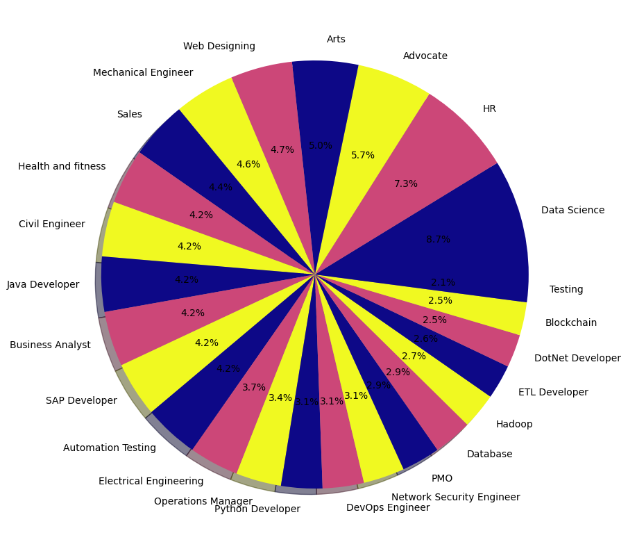

# Resume-Role-Screening

## Dataset
The dataset was taken from kaggle, also uploaded in the assets named UpdatedResumeDataset.csv in this repository

## Model Training
The dataset was preprocessed through removing emails, mentions, special characters, stopwords and lemmatization.
Afterwards, They were converted to tfidf vectors to have semantic meaning within the texts.
Also, detailed EDA and plots are clearly shown step by step.

The resume role categories with distribution is below:


Then after labelencoding, the model was trained by few ML algorithms and finally LogisticRegression showed 99.48% accuracy.
For further use, reume_role_mode.pkl, tfidf_vectorizer.pkl and label_encoder.pkl files were saved. [link for pkl files](assets).
[model.ipynb](assets/model.ipynb) to see the model training code.

## FastAPI Endpoints
The fastapi had default home endpoint 'home' and the prediction endpoint '/predict_role/'
The same text preprocessing are done on the texts extracted from pdf through PyPDF2
To run:
Go to terminal:
```Terminal 
uvicorn main:app --reload
```
Then your browser will open. Go to '/docs' like: 

```docs
http://127.0.0.1:8000/docs
```
Then FastAPi - Swagger UI wil appear. Now,
```
click on /predict_role/ -> try it out -> upload pdf -> Execute
```

Now you can see the predicted roles like 'Data Scientist', 'Sales', 'Python Developer' etc

## Docker 
A docker image was created for scalability with [requirements.txt](assets/requirements.txt) and accessibility.
The port was exposed as 10000 just for experiment in stead of 8000.
The code is in [Dockerfile](assets/Dockerfile).
You have to have complete 'Docker Desktop' and 'Docker hub' setup
Then build the image:
```
docker build -t mehedi3128/resume-role-screening-api .
```
My username is mehedi3128 and the name of the docker image is resume-role-screening-api
The 'main:app' in the CMD of Dockerfile automatically hits the fastapi main.py endpoints.
Run the docker image from terminal:
```
docker run -p 10000:10000 mehedi3128/resume-role-screening-api
```
Then normally go to /docs and predict the resume role

The docker image was uploaded or pushed to the docker hub.


To upload, go to terminal:
```
docker login
docker push mehedi3128/resume-role-screening-api
```

## Streamlit WebApp
To make the whole system interactive, a streamlit webapp [frontend.py](assets/frontend.py) was built.
It takes the '.pkl' files and finally shows the predicted output
To run the streamlit app, go to the terminal:
```
streamlit run frontend.py
```
Upload the pdf and shows the resume roles output after screening the pdf file.


# The workflow of the final WebApp:
```
streamlit -> docker image -> fastapi -> get response -> docker image -> streamlit -> show predicted resume role
```

Thus the whole system works and hope anyone can build it from scratch using the detailed step by step description with the provided [assets](/assets) in this repository.
